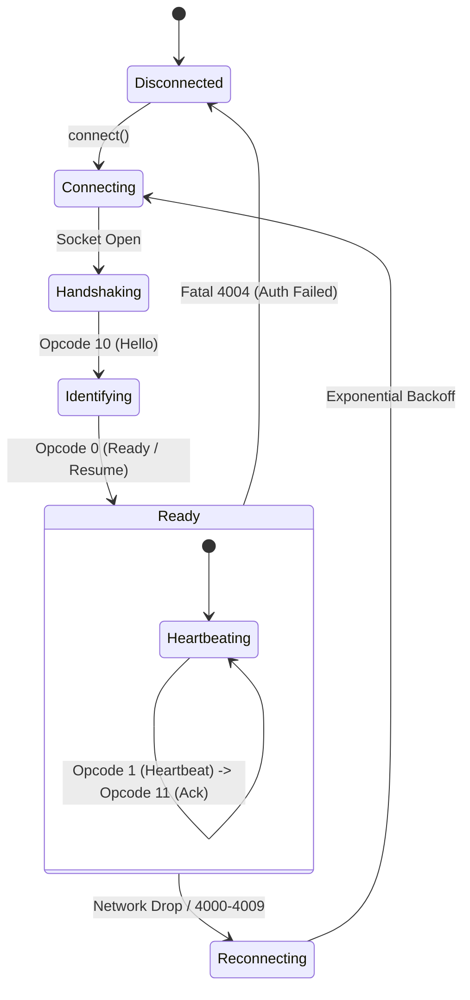

The Discord Gateway is a real-time, bi-directional WebSocket connection used by bots to receive events (messages, member joins, interaction triggers, voice updates) and send presences.

---

## Gateway Lifecycle



---

## Gateway Intents

Intents allow bots to subscribe only to the events they require, reducing memory usage and bandwidth.

Lunibee supports both:
1. **`IntentBits`** (Lunibee's camelCase constants, e.g. `IntentBits.messageContent`, `IntentBits.guilds`)
2. **`IntentBits`** (Discord API standard PascalCase constants, e.g. `IntentBits.messageContent`, `IntentBits.guilds`)

You can pass them as an array or combine them using bitwise OR (`|`):

```ts
import { Client, IntentBits, IntentBits } from "lunibee";

// Using Lunibee's camelCase IntentBits array (Recommended)
const client = new Client({
  token: process.env.DISCORD_TOKEN!,
  intents: [
    IntentBits.guilds,
    IntentBits.guildMessages,
    IntentBits.messageContent,
  ],
});

// Or using Discord's standard PascalCase IntentBits
const client2 = new Client({
  token: process.env.DISCORD_TOKEN!,
  intents: [
    IntentBits.guilds,
    IntentBits.guildMessages,
    IntentBits.messageContent,
  ],
});
```

---

## Privileged Intents

Three intent categories require enabling in the [Discord Developer Portal](https://discord.com/developers/applications) under your bot's **Bot &rarr; Privileged Gateway Intents** settings:

1. **Message Content** (`IntentBits.messageContent` / `IntentBits.messageContent`): Required to read the text content and attachments of messages sent by other users.
2. **Guild Members** (`IntentBits.guildMembers` / `IntentBits.GuildMembers`): Required to receive `GUILD_MEMBER_ADD`, `GUILD_MEMBER_UPDATE`, and track member joins/leaves.
3. **Presences** (`IntentBits.guildPresences` / `IntentBits.GuildPresences`): Required to track user activity and status changes.

---

## Intents Reference Table

| Intent Flag (`IntentBits` / `IntentBits`) | Bitfield Value | Events Included |
|---|---|---|
| `guilds` / `Guilds` | `1 << 0` | `GUILD_CREATE`, `GUILD_UPDATE`, `GUILD_DELETE`, `CHANNEL_*` |
| `guildMembers` / `GuildMembers` | `1 << 1` | `GUILD_MEMBER_ADD`, `GUILD_MEMBER_UPDATE`, `GUILD_MEMBER_REMOVE` *(Privileged)* |
| `guildModeration` / `GuildModeration` | `1 << 2` | `GUILD_AUDIT_LOG_ENTRY_CREATE`, `GUILD_BAN_ADD`, `GUILD_BAN_REMOVE` |
| `guildEmojisAndStickers` / `GuildEmojisAndStickers` | `1 << 3` | `GUILD_EMOJIS_UPDATE`, `GUILD_STICKERS_UPDATE` |
| `guildIntegrations` / `GuildIntegrations` | `1 << 4` | `INTEGRATIONS_UPDATE` |
| `guildWebhooks` / `GuildWebhooks` | `1 << 5` | `WEBHOOKS_UPDATE` |
| `guildInvites` / `GuildInvites` | `1 << 6` | `INVITE_CREATE`, `INVITE_DELETE` |
| `guildVoiceStates` / `GuildVoiceStates` | `1 << 7` | `VOICE_STATE_UPDATE` |
| `guildPresences` / `GuildPresences` | `1 << 8` | `PRESENCE_UPDATE` *(Privileged)* |
| `guildMessages` / `GuildMessages` | `1 << 9` | `MESSAGE_CREATE`, `MESSAGE_UPDATE`, `MESSAGE_DELETE` |
| `guildMessageReactions` / `GuildMessageReactions` | `1 << 10` | `MESSAGE_REACTION_ADD`, `MESSAGE_REACTION_REMOVE` |
| `messageContent` / `MessageContent` | `1 << 15` | Message text, embeds, and attachments *(Privileged)* |
