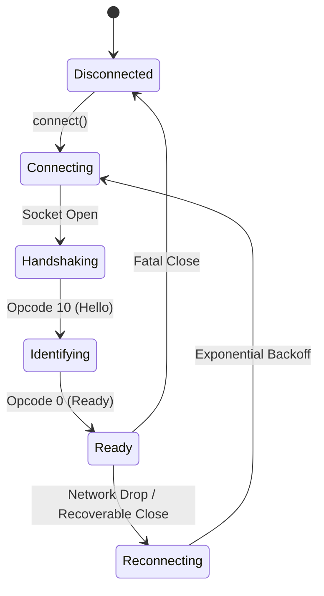

The Discord Gateway is a real-time, bi-directional WebSocket connection used by bots to receive events and send presences.

## Gateway Lifecycle



## Gateway Intents

Lunibee exposes both camelCase and Discord-standard PascalCase intent constants:

- `IntentBits` — camelCase constants such as `IntentBits.guilds`.
- `GatewayIntentBits` — PascalCase constants such as `GatewayIntentBits.Guilds`.
- `Intents` — alias for `IntentBits`.

Both forms can be passed as an array or combined with bitwise OR.

```ts
import { Client, IntentBits, GatewayIntentBits } from "lunibee";

const client = new Client({
  token: process.env.DISCORD_TOKEN!,
  intents: [
    IntentBits.guilds,
    IntentBits.guildMessages,
    IntentBits.messageContent,
  ],
});

const client2 = new Client({
  token: process.env.DISCORD_TOKEN!,
  intents:
    GatewayIntentBits.Guilds |
    GatewayIntentBits.GuildMessages |
    GatewayIntentBits.MessageContent,
});
```

## Privileged Intents

`MessageContent`, `GuildMembers`, and `GuildPresences` are privileged Gateway intents. Enable the corresponding intents for your bot in the Discord Developer Portal before requesting them.

## Intents Reference

| PascalCase (`GatewayIntentBits`) | camelCase (`IntentBits`) | Bit Shift | Type |
|---|---|---|---|
| `Guilds` | `guilds` | `1 << 0` | Standard |
| `GuildMembers` | `guildMembers` | `1 << 1` | Privileged |
| `GuildModeration` | `guildModeration` | `1 << 2` | Standard |
| `GuildExpressions` | `guildExpressions` | `1 << 3` | Standard |
| `GuildIntegrations` | `guildIntegrations` | `1 << 4` | Standard |
| `GuildWebhooks` | `guildWebhooks` | `1 << 5` | Standard |
| `GuildInvites` | `guildInvites` | `1 << 6` | Standard |
| `GuildVoiceStates` | `guildVoiceStates` | `1 << 7` | Standard |
| `GuildPresences` | `guildPresences` | `1 << 8` | Privileged |
| `GuildMessages` | `guildMessages` | `1 << 9` | Standard |
| `GuildMessageReactions` | `guildMessageReactions` | `1 << 10` | Standard |
| `GuildMessageTyping` | `guildMessageTyping` | `1 << 11` | Standard |
| `DirectMessages` | `directMessages` | `1 << 12` | Standard |
| `DirectMessageReactions` | `directMessageReactions` | `1 << 13` | Standard |
| `DirectMessageTyping` | `directMessageTyping` | `1 << 14` | Standard |
| `MessageContent` | `messageContent` | `1 << 15` | Privileged |
| `GuildScheduledEvents` | `guildScheduledEvents` | `1 << 16` | Standard |
| `AutoModerationConfiguration` | `autoModerationConfiguration` | `1 << 20` | Standard |
| `AutoModerationExecution` | `autoModerationExecution` | `1 << 21` | Standard |
| `GuildMessagePolls` | `guildMessagePolls` | `1 << 24` | Standard |
| `DirectMessagePolls` | `directMessagePolls` | `1 << 25` | Standard |
