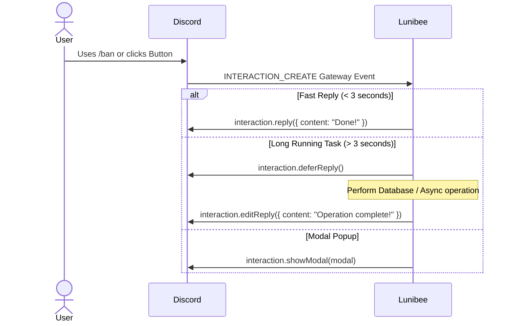

Discord Interactions provide modern, structured interfaces for user input. Lunibee offers typed structures for all interaction types with built-in response management (initial reply, deferred replies, ephemeral flags, edits, follow-ups, and modal popups).

---

## The Interaction Lifecycle

When a user triggers an interaction, Discord sends an `INTERACTION_CREATE` payload over the Gateway. Discord requires an initial acknowledgment within **3 seconds** (either replying directly, deferring the reply, or opening a modal).



---

## `ChatInputCommandInteraction` (Slash Commands)

Triggered when a user executes a Slash Command.

```ts
import { Client, EmbedBuilder, MessageFlags } from "lunibee";

client.on("interactionCreate", async (interaction) => {
  if (!interaction.isChatInputCommand()) return;

  const { commandName, options } = interaction;

  if (commandName === "userinfo") {
    const targetUser = options.getUser("target") ?? interaction.user;

    const embed = new EmbedBuilder()
      .setTitle(`User Info - ${targetUser.username}`)
      .setThumbnail(`https://cdn.discordapp.com/avatars/${targetUser.id}/${targetUser.avatar}.png`)
      .addFields(
        { name: "User ID", value: targetUser.id, inline: true },
        { name: "Bot Account", value: targetUser.bot ? "Yes" : "No", inline: true }
      );

    await interaction.reply({
      embeds: [embed],
      ephemeral: true, // Visible only to the command runner
    });
  }
});
```

### Reading Command Options
- `options.getString(name, required?)`: Returns `string | null`
- `options.getInteger(name, required?)`: Returns `number | null`
- `options.getNumber(name, required?)`: Returns `number | null`
- `options.getBoolean(name, required?)`: Returns `boolean | null`
- `options.getUser(name, required?)`: Returns `APIUser | null`
- `options.getChannel(name, required?)`: Returns `APIChannel | null`
- `options.getRole(name, required?)`: Returns `APIRole | null`
- `options.getAttachment(name, required?)`: Returns `APIAttachment | null`
- `options.getSubcommand()`: Returns string name of the executed subcommand

---

## `ButtonInteraction` & `StringSelectInteraction`

Triggered when a user clicks a button or selects options in a dropdown.

```ts
client.on("interactionCreate", async (interaction) => {
  if (!interaction.isComponent()) return;

  const { customId } = interaction;

  // Handle Button Clicks
  if (customId === "btn_verify") {
    await interaction.deferReply({ ephemeral: true });

    // Assign verified role
    await interaction.member?.roles.add("123456789012345678");

    await interaction.editReply({
      content: "✅ You have been verified and granted access!",
    });
  }

  // Handle Select Menu Changes
  if (customId === "select_color_roles") {
    const selectedValues = interaction.values; // string[] array of selected choice values
    await interaction.reply({
      content: `Selected colors: ${selectedValues.join(", ")}`,
      ephemeral: true,
    });
  }
});
```

---

## `ModalSubmitInteraction`

Triggered when a user submits a modal popup.

```ts
client.on("interactionCreate", async (interaction) => {
  if (!interaction.isModalSubmit()) return;

  if (interaction.customId === "modal_ticket") {
    const subject = interaction.fields.getTextInputValue("ticket_subject");
    const description = interaction.fields.getTextInputValue("ticket_description");

    await interaction.reply({
      content: `Ticket created! **Subject:** ${subject}`,
      ephemeral: true,
    });
  }
});
```

---

## `AutocompleteInteraction`

Provides live suggestions as a user types into a slash command option.

```ts
client.on("interactionCreate", async (interaction) => {
  if (!interaction.isAutocomplete()) return;

  const focusedOption = interaction.options.getFocused(true); // { name, value }

  if (focusedOption.name === "tag") {
    const allTags = ["javascript", "typescript", "bun", "discord", "rust"];
    const filtered = allTags.filter(t => t.startsWith(focusedOption.value.toLowerCase()));

    await interaction.respond(
      filtered.map(tag => ({ name: tag, value: tag }))
    );
  }
});
```

---

## Response Methods Reference

| Method | Description |
|---|---|
| `interaction.reply(options)` | Sends the initial message response (accepts `content`, `embeds`, `components`, `ephemeral`). |
| `interaction.deferReply(options?)` | Acknowledges the interaction immediately and displays a thinking state (`ephemeral?`). |
| `interaction.editReply(options)` | Edits the initial response (useful after deferring). |
| `interaction.deleteReply()` | Deletes the initial interaction response. |
| `interaction.followUp(options)` | Sends secondary follow-up messages linked to the interaction. |
| `interaction.showModal(modal)` | Pops up an interactive modal dialog for user input. |
